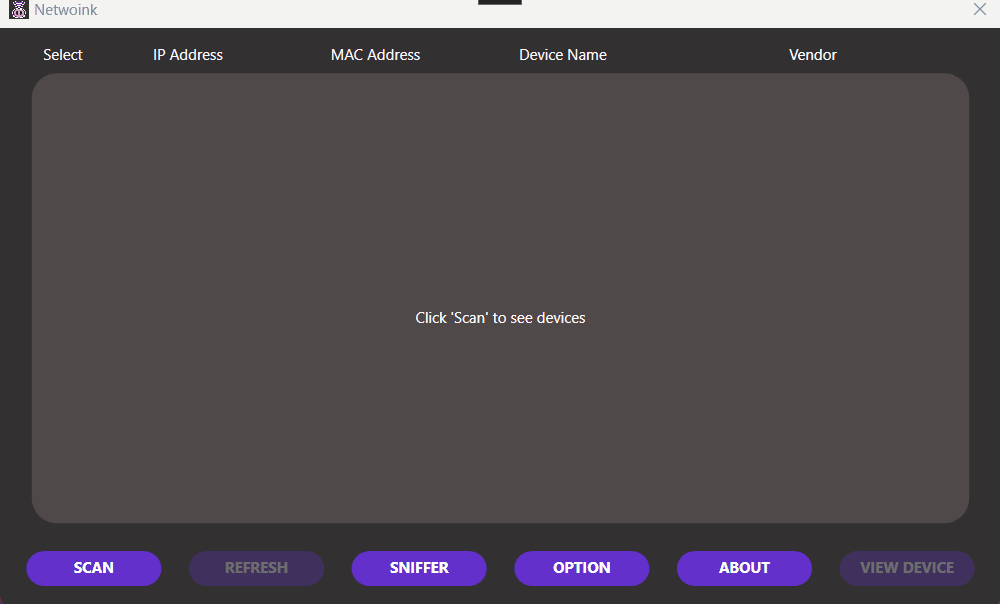
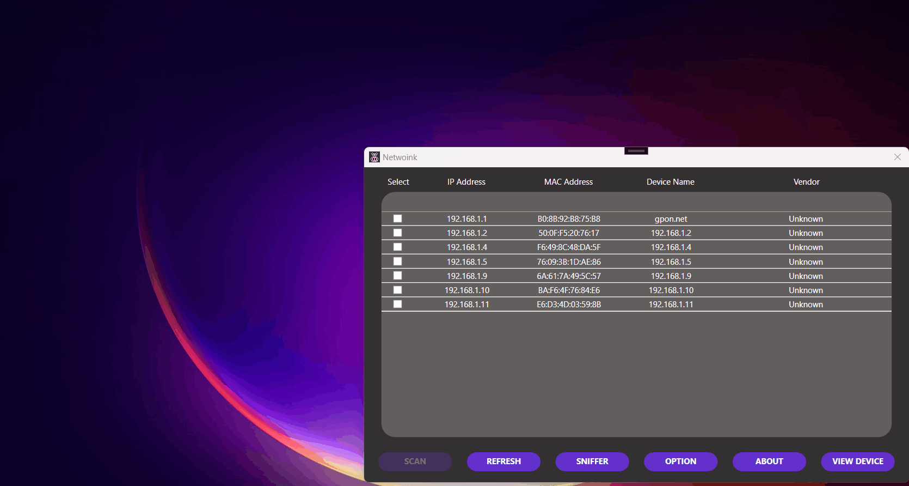
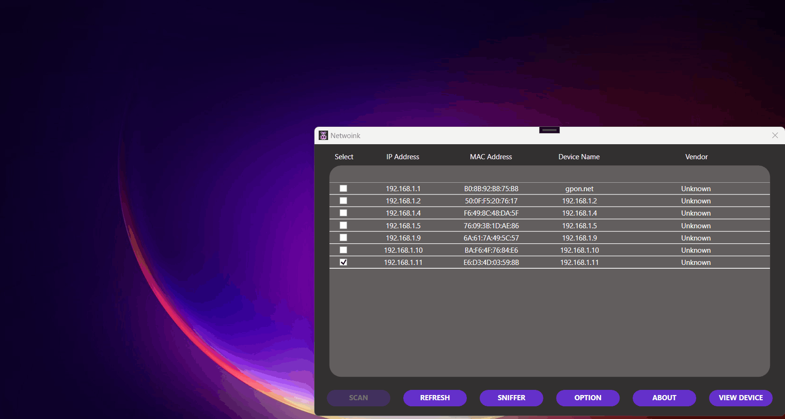

   

# NetWoink
  A lightweight and simple open-source network management/tracking app. 

##  <a id = "obj"> 📈 Objective </a> 

 
The project is aligned with the 17 Sustainable Development Goals (SDG), specifically the following:

> 8th Decent Work and Economic Growth  
> 9th Industry, Innovation and Infrastracture  
> 11th Sustainable Cities and Communities  
## Features

### Network Scan

   

- Scan the network using ARP and SMNP Network Protocols. 
- Displays devices' information connected in the network.
- Retrieves vendor data from the macvendors website for the vendor information. 

### Packet Sniffing

   

- A Packet Sniffer that is intended to log addresses that each device on the network visits with the ability to decode HTTP headers for HTTP packets and resolve domains for HTTPS packets, also the packet direction can be chosen in order to capture requests only or requests and responses.  
 
- A packet viewer to view the properties of a selected packet in the Packet Sniffer with the ability to expand the viewer for better visibility.

### Device Info

   

- Tracks devices environmental and utility aspect. 
- Captures devices' environmental footprint depending on their runtime connectivity with the system. 

 

##  <a id = "tech-stacks"> ⚙️ Tools and Libraries </a> 
The following listed tools are utilized in this project.  

- [x] C#   
- [x] Windows Presentation Form (WPF)   
- [x] PcapDotNet   
- [x] NpCap   
- [x] SharpPcap   

 

##  <a id = "contrib"> 👷‍ Contributors </a>  

| Name | Role | E-mail | Other Contacts |
| --- | --- | --- | --- |
| <a href = "https://github.com/DirkSteven">Dirk Steven E. Javier</a> | Project Leader, Developer | dirkjaviermvp@gmail.com | Allonsy -Discord |
| <a href = "https://github.com/m-ciavel"> Ciavel Anby P. Montenegro </a>| Developer | m.cap1218@gmail.com |  |
| <a href = "https://github.com/VinceAbella"> Vince Jericho Abella </a>| Developer | vinceabella07@gmail.com |  |
| <a href = "https://github.com/sy1ph"> Jane Benedicta Tolentino </a>|  Developer  | jbtolentino.827.04@gmail.com |  |

##  <a id = "notes"> 📝 Notes </a> 
<em>

[1] <b>Network Scanning employs ARP Protocol, it starts scanning from the address range of 0-255 and is set to scan for 60 seconds. Therefore, some devices in the with greater range might be not scanned. It is recommended to set the addresses of the devices starting from 0.  </b>

[2] <b>Moreover, It is recommendeed to select a LAN adaptor for the system for reduced latency and Network Scanning capabilities. </b>

[3] <b>Vendor might display "Unknown" depending on the availability of the device data on the macvendors API database.   </b>

  
